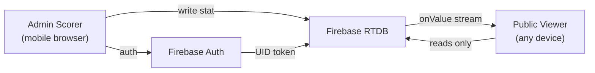

# LOC Basketball League Website

## Tech Stack

- **Next.js 14** (App Router) — deployed to Vercel free tier
- **Firebase Realtime Database** — live data sync via `onValue` listeners
- **Firebase Authentication** — single admin account (email/password)
- **Tailwind CSS** — mobile-first dark theme matching the provided designs
- **No backend server needed** — Firebase handles all real-time data

## Project Structure

```
loc-website/
├── app/
│   ├── layout.tsx                  # Global layout + bottom nav
│   ├── page.tsx                    # Redirect → /scores
│   ├── scores/page.tsx             # Live scores viewer (Image 1)
│   ├── games/page.tsx              # Schedule/upcoming games
│   ├── news/page.tsx               # League news
│   ├── stats/page.tsx              # League-wide player stats
│   ├── game/[id]/page.tsx          # Individual live game detail
│   └── admin/
│       ├── login/page.tsx          # Admin login screen
│       ├── scorer/page.tsx         # Scorer's Dashboard (Image 2)
│       ├── roster/page.tsx         # Manage teams & players
│       └── config/page.tsx         # Create/configure games
├── components/
│   ├── LiveScoreCard.tsx           # Live game card with score + clock
│   ├── RecentPlays.tsx             # Scrolling play-by-play feed
│   ├── TopPerformers.tsx           # Top stats players list
│   ├── BottomNav.tsx               # Mobile bottom navigation bar
│   ├── ScorerPad.tsx               # +2, +3, FT, REB, AST, STL buttons
│   └── PlayerSelector.tsx          # Tap-to-select player list
├── lib/
│   ├── firebase.ts                 # Firebase app init + exports
│   ├── auth.ts                     # Auth helpers + admin guard hook
│   └── gameService.ts              # Read/write helpers for RTDB
├── middleware.ts                    # Protect /admin/* routes
├── tailwind.config.ts
├── package.json
└── .env.local                      # Firebase config keys
```

## Firebase Realtime Database Schema

```json
{
  "games": {
    "{gameId}": {
      "homeTeamId": "t1",
      "awayTeamId": "t2",
      "homeScore": 84,
      "awayScore": 79,
      "quarter": 4,
      "timeRemaining": "05:24",
      "status": "scheduled | live | final",
      "date": "2026-02-23"
    }
  },
  "teams": {
    "{teamId}": { "name": "Stallions", "shortName": "STL" }
  },
  "players": {
    "{playerId}": {
      "name": "Stephen Curry",
      "number": 30,
      "position": "Guard",
      "teamId": "t1"
    }
  },
  "gameStats": {
    "{gameId}": {
      "{playerId}": { "pts": 28, "reb": 11, "ast": 6, "stl": 2, "blk": 0 }
    }
  },
  "recentPlays": {
    "{gameId}": {
      "{playId}": {
        "description": "M. Thompson made a 3-pt shot",
        "assistBy": "J. Carter",
        "time": "05:41",
        "timestamp": 1234567890
      }
    }
  }
}
```

## Key Pages & Behaviour

**Public - Scores (`/scores`)** — Image 1 design

- Subscribes to `games/` with `onValue` — any score update instantly re-renders
- Shows LIVE badge, team logos/initials, score, quarter + clock
- Recent plays feed auto-scrolls as new plays are pushed
- Top performers sorted by PTS descending

**Admin - Scorer's Dashboard (`/admin/scorer`)** — Image 2 design

- Protected by Firebase Auth (redirect to `/admin/login` if not signed in)
- Home/Away team toggle at top
- Tapping a stat button (+2, +3, FT, REB, AST, STL) requires a player to be selected first; then writes an atomic update to `gameStats` and appends to `recentPlays`
- **Undo** button reverts the last write (stored in local state)
- Clock control: start/stop/set quarter

**Admin - Config (`/admin/config`)**

- Create new games (pick teams, set date)
- Set game status to Live/Final
- Edit clock time

**Admin - Roster (`/admin/roster`)**

- Add/edit/remove teams and players

## Data Flow




## Firebase Security Rules (RTDB)

- All nodes: **public read**
- Write access: **only authenticated admin UID**

## Colour Theme (from designs)

- Page background: `#0d1420`
- Card background: `#161f2e`
- Accent blue (buttons/highlights): `#3b9eff`
- Muted text: `#6b7a8d`
- Live badge: red `#ef4444`

## Deployment

- `vercel deploy` connects the GitHub repo — auto-deploys on push
- Firebase project on Spark (free) plan — Realtime DB + Auth
- Environment variables (`NEXT_PUBLIC_FIREBASE_`*) set in Vercel dashboard

